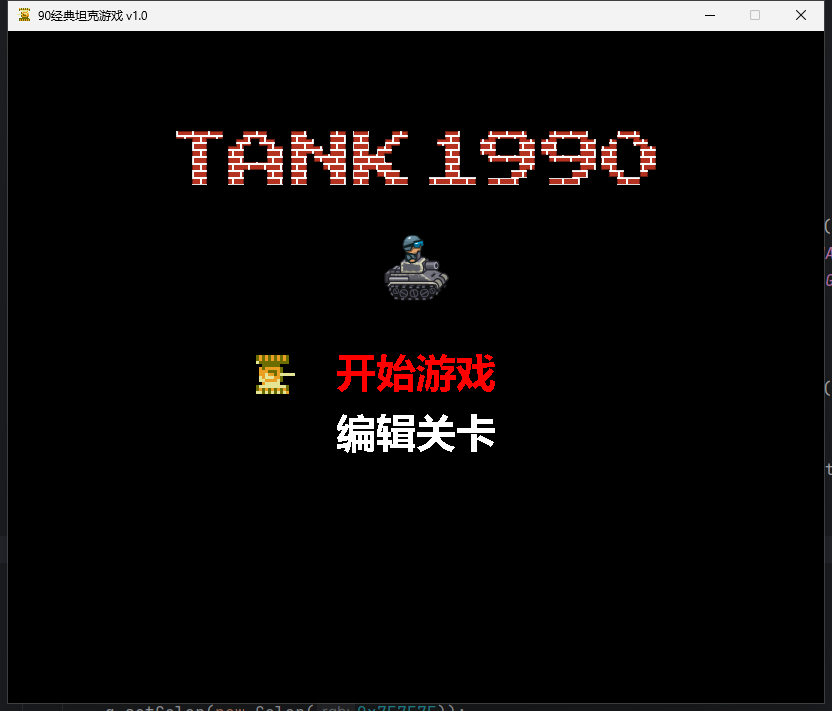
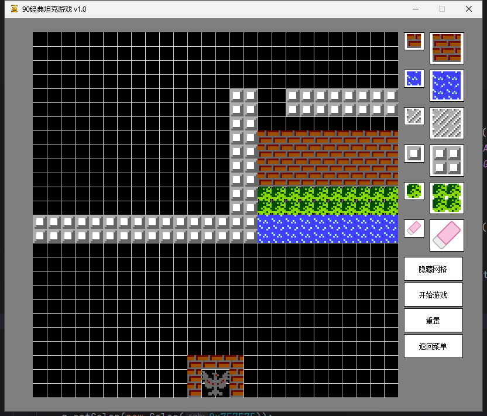

# 简介

> 基于Java Swing实现的90坦克大战经典

该系统实现ECS（Entity Component System）系统来完成坦克游戏的开发

# 操作指南

## 欢迎界面

- W: 向上切换菜单
- S: 向下切换菜单
- ENTER: 进入菜单

## 关卡界面

- W: 向上运动
- S: 向下运动
- D: 向右运动
- A: 向左运动
- SPACE: 发射子弹

# 游戏界面

